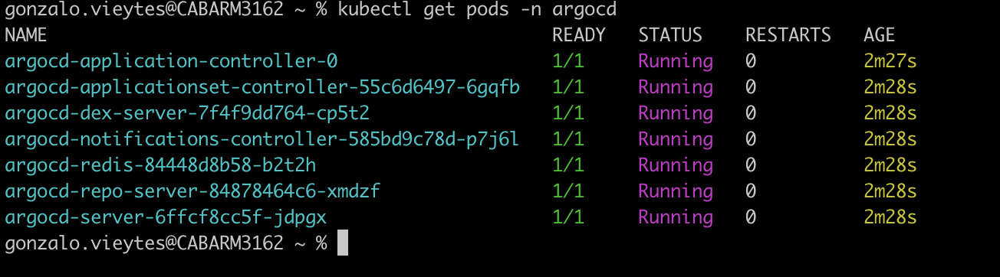
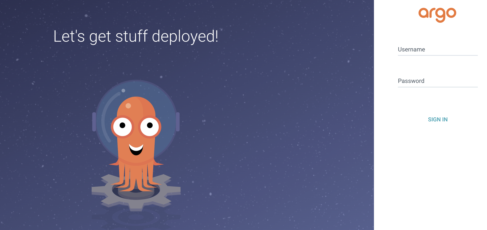
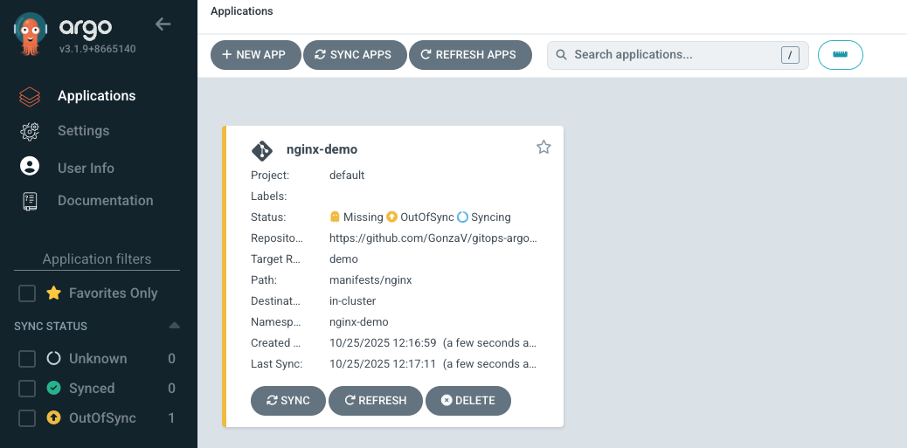

# gitops-argo

## Qué es este repositorio?

Este repositorio contiene la documentación y manifiestos básicos para probar de manera local Argo CD y entender los fundamentos de GitOps.

## Contenido

1. [Conocimientos teóricos necesarios](#conocimientos-teóricos-necesarios)
2. [Herramientas necesarias](#herramientas-necesarias)
3. Paso a paso 
   - [Instalación y preparación de Argo CD](#instalación-y-preparación-de-argo-cd)
   - [Creación y Sincronización de una Aplicación](#creación-y-sincronización-de-una-aplicación)

## Conocimientos teóricos necesarios

Antes de empezar, es recomendable leer la [introducción a GitOps](/docs/gitops.md)

## Herramientas necesarias

Para seguir el [paso a paso](#paso-a-paso), se necesita tener instaladas las siguientes herramientas en tu equipo.

> Estas y el restante de las instrucciones están pensadas para entornos Linux o MacOs. Se asume que se cuenta con Git instalado.

1. **Docker**

    Es necesario tener un entorno de ejecución de contenedores.
    En esta práctica se usará [Podman](https://podman.io/), pero existen alternativas como [Docker Desktop](https://docs.docker.com/desktop/) o [Colima](https://github.com/abiosoft/colima).

2. **Cluster local de Kubernetes**

    En esta práctica se usará [Minikube](https://minikube.sigs.k8s.io/docs/), pero existen [Kind](https://kind.sigs.k8s.io/) como alternativa viable.

3. **Kubectl**

    [Kubectl](https://kubernetes.io/docs/tasks/tools/#kubectl) es el cliente oficial de Kubernetes. Será necesario para aplicar cambios manuales en el cluster.

### Verificación rápida

Abrir una terminal y correr los siguientes comandos:

```bash
colima status

minikube status

kubectl get nodes
```

Si todos responden sin errores, está todo listo para comenzar.
    
## Paso a paso

### Instalación y preparación de Argo CD

// TODO mejoras: asegurarnos de estar trabajando en el cluster local con kubectl config get-contexts. En "Creación y Sincronización de una Aplicación" se crea manualmente la aplicacion de argo por simplicidad, asegurarse de comentar que hay alternativas, ya que esto tambien requiere permisos que no deberian tener todos los devs.

Como primer paso, es necesario crear el namespace `argocd` y aplicar en el los recursos y servicios de Argo.

Para eso ejecutamos en una consola:

```bash
kubectl create namespace argocd
kubectl apply -n argocd -f https://raw.githubusercontent.com/argoproj/argo-cd/stable/manifests/install.yaml
```

Kubectl va a listarnos los recursos nativos de Kubernetes que aplico bajo el namespace `argocd` que creamos.

Confirmamos que los pods de Argo estan corriendo:

```bash
kubectl get pods -n argocd 
```


Con Argo levantado, lo siguiente es exponer su API y UI. No existe una única forma de hacer esto, pero la más sencilla, sin aplicar otras configuraciones ni recursos de k8s, es exponer el `service argocd-server` con el comando `port-forward`.

En una **nueva instancia de nuestra consola** corremos el siguiente comando:

```bash
kubectl port-forward svc/argocd-server -n argocd 8080:443
```

Es importante hacerlo en una nueva consola ya que este proceso es continuo y no nos va a permitir ejecutar otros comandos.

Si todo salió bien, ya es posible ingresar a la UI en http://localhost:8080 con cualquier navegador.



Argo genera un usuario `admin` con una contraseña inicial que podemos obtener con:

```bash
kubectl get secret argocd-initial-admin-secret -n argocd -o jsonpath='{.data.password}' | base64 -d
```

Estas son las credenciales que vamos a usar para ingresar a la UI expuesta en localhost.

### Creación y Sincronización de una Aplicación

#### Creación

En este punto, nuestro cluster de Kubernetes está corriendo de forma local, Argo CD está deployado en ese ambiente y su UI accesible en localhost:8080. Es momento de crear una `Aplicación`.

Las aplicaciones de Argo son la representación de nuestros servicios deployados o por deployar y brindan, entre otras cosas, dos piezas centrales de información: la fuente o referencia al estado deseado (nuestro repositorio) y el cluster destino.

Por simplicidad del ejemplo, vamos a hacer una creación manual haciendo uso del [CRD](https://kubernetes.io/docs/concepts/extend-kubernetes/api-extension/custom-resources/) `Application` de Argo.

En este mismo repositorio se encuentra el archivo [nginx-app.yml](./apps/nginx-app.yml). Vamos a aplicar el mismo de esta forma desde el directorio en donde se encuentra (o usando un path relativo):

```bash
  kubectl apply -f nginx-app.yml
```

> **Nota:** La fuente de verdad para esta aplicación se describe bajo los campos`.spec. source.targetRevision` y `.spec.source.repoURL`. Modificarlos de ser necesario.

Esto va a ser inmediatamente reflejado en la UI de Argo, pero nos vamos a encontrar con que su estado no es correcto:
- App Health: Missing
- Sync Status: OutOfSync



> **Nota:** El estado de una aplicación es igual al estado más severo de cualquiera de sus recursos hijos directos. En este caso la aplicación podría pasar de "Missing" a "Degraded" si k8s cambia el estado de algun recurso por uno erroneo.    

Una de las mayores virtudes de Argo CD es que nos da retroalimentación inmediata para detectar y corregir errores desde el repositorio.

En este caso, el [configmap.yml](/manifests/nginx/configmap.yml) tiene un valor erroneo en `.metadata.namespace`. El valor correcto es `nginx-demo`, ya que es el namespace donde estamos aplicando nuestro [deployment.yml](/manifests/nginx/deployment.yml) y donde espera encontrar el configmap que este mismo esta intentando utilizar.

#### Sincronización

El siguiente paso es corregir nuestros manifiestos en el repositorio para que puedan ser aplicados en el cluster y asi lograr que, tanto lo declarado en nuestra SSOT como lo que existe en el cluster, este sincronizado.

En nuestro fichero [configmap.yml](/manifests/nginx/configmap.yml) modificamos el valor del campo `.metadata.namespace` por el mismo que utilizan los otros recursos de nuestro servicio:

`namespace: nginx-demo`

Gracias a que nuestra Application está configurada de esta manera:

```yaml
syncPolicy:
    automated: {
        selfHeal: true
    }
```

Argo va a aplicar las sincronizaciones de manera automática en cuanto detecte una divergencia, y no esperar a que algún usuario lo haga mediante un comando o la interfaz gráfica.

Una vez hagamos push de los cambios a nuestro repositorio, la sincronización se va a dar luego de unos minutos (este tiempo es modificable) dejando a nuestro servicio listo.

Para corroborar que todo funcione, realizamos un port-forward a nuestro nginx para poder acceder a el desde localhost:

```bash
kubectl port-forward svc/nginx-service -n nginx-demo 8081:80
```

Al acceder a localhost:8081 se debería ver el mensaje de bienvenida "Hello from Argo CD Demo!"

#### Protección contra cambios manuales

Argo sincroniza nuestros recursos mediante un mecanismo [pull-based](./docs/gitops.md#pull-based). Esto implica, entre otras cosas, que la herramienta aplica los cambios hechos en el respositorio y también revierte cualquier cambio manual que se realice, velando por mantener el repositorio como SSOT.

Para probar esto vamos a editar nuestro mensaje de bienvenida, aplicando el path con kubectl:

```bash
kubectl edit configmap nginx-config -n nginx-demo
```

Una vez aplicado el cambio, y gracias a la configuracion `selfHeal: true` de nuestra aplicación, Argo va a hacer el rollback de manera casi instantanea. Aunque el cambio sea rápido, la aplicación paso de estar sincronizada, a un sync status "OutOfSync" para luego, gracias al selfHeal, volver a sincronizarse automáticamente con el contenido del cluster.
